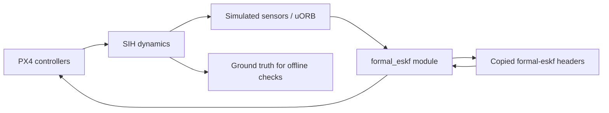

# PX4 SITL integration

This directory owns the PX4 wrapper, board configuration, installation tools and flight tests. The numerical core remains in `include/formal_eskf/`. Installing copies both the wrapper and core headers into PX4; the PX4 build does not reference the original formal-eskf checkout.

The supported target is **PX4 v1.16.2**, commit `54f0455ffcd755534539a7cf33a09a20bf71d29d`, on Linux with GCC 11 or newer and C++20. The dedicated `px4_sitl_formal_eskf` board replaces EKF2 with a single-instance formal-eskf INS using the PX4 matrix backend and double precision.

## Source ownership

| Source in formal-eskf | Installed location in PX4 | Purpose |
| --- | --- | --- |
| `integrations/px4/module/` | `src/modules/formal_eskf/` | uORB adapter, module build, Kconfig and parameter |
| `include/formal_eskf/` | `src/modules/formal_eskf/core/include/formal_eskf/` | Complete header-only numerical core |
| `LICENSE` | `src/modules/formal_eskf/core/LICENSE` | Core and adapter license |
| `integrations/px4/formal_eskf.px4board` | `boards/px4/sitl/formal_eskf.px4board` | SIH build with EKF2 disabled |
| `integrations/px4/px4-v1.16.2.patch` | Three existing PX4 files | Startup selection, odometry logging and SIH link dependency |

Edit the source in formal-eskf, run the installer again, and rebuild PX4. Changes in formal-eskf do not automatically change an already installed package. PX4 receives regular copied files, with no symlinks, submodule or `FORMAL_ESKF_ROOT` dependency.

## Setup and build

Run these commands from the formal-eskf repository root. `PX4_ROOT` can be anywhere writable; the sibling path below is only an example.

```bash
PX4_ROOT="$(pwd)/../PX4-Autopilot"
./integrations/px4/setup.sh "$PX4_ROOT"
make -C "$PX4_ROOT" px4_sitl_formal_eskf -j8
```

`setup.sh` clones the pinned revision if the target does not exist, initializes only the required MAVLink, events and compression submodules, and installs the package. An existing PX4 checkout must match the pinned commit. It preserves unrelated edits and stops on conflicting files.

Build dependencies include GCC/G++, CMake, Ninja, Python and PX4's `Tools/setup/requirements.txt` (including `empy<4`). Eigen3 is required for the native test oracle. Install the flight test dependencies with:

```bash
python3 -m pip install -r integrations/px4/requirements.txt
```

For an existing PX4 checkout with dependencies already initialized, installation is offline:

```bash
python3 integrations/px4/install.py --px4 "$PX4_ROOT"
make -C "$PX4_ROOT" px4_sitl_formal_eskf -j8
python3 integrations/px4/install.py --px4 "$PX4_ROOT" --check
```

The installer records source revision, source dirty state, and SHA256 hashes in `src/modules/formal_eskf/package-manifest.json`. `--check` checks the copied files and host patch; it does not establish that the binary has been rebuilt. Each flight records the installed manifest and the tested binary's SHA256.

Installation is repeatable. Previously installed files can be updated only if their contents match the previous manifest or the new package. Conflicting local changes and unknown files in the module cause an error before installation. Reconcile or move those files before retrying. A pre-package POC module has no ownership manifest and must be moved aside before its modified files can be replaced.

## Export a package to another machine

```bash
python3 integrations/px4/install.py --export build/px4-package
```

The new directory contains `overlay/`, `manifest.json`, the small PX4 patch and a standalone `install.py`. Copy that directory to the destination machine, then run:

```bash
python3 /path/to/px4-package/install.py --px4 /path/to/PX4-Autopilot
make -C /path/to/PX4-Autopilot px4_sitl_formal_eskf -j8
```

The destination requires the pinned PX4 checkout and its build dependencies. It does not need the formal-eskf source repository. Exports require a new directory to avoid overwriting an earlier package. The manifest detects accidental changes to exported payload files and the host patch.

## Automatic flight

Run from the formal-eskf repository root in a system terminal:

```bash
PX4_ROOT="$(pwd)/../PX4-Autopilot"
RUN_DIR="build/sitl-$(date +%Y%m%d-%H%M%S)"
python3 integrations/px4/sitl_flight.py \
  --px4 "$PX4_ROOT" --output "$RUN_DIR" --check-faults
MPLCONFIGDIR=/tmp/formal-eskf-mpl \
  python3 integrations/px4/analyze_flight.py "$RUN_DIR"
xdg-open "$RUN_DIR/flight.png"
```

The test starts PX4 SIH, uses normal arming, takes off to 5 m, hovers, flies an 8 x 8 m square with a 45-degree heading change, returns, lands and waits for automatic disarming. It then checks invalid GNSS, GNSS timeout and magnetometer timeout, including recovery. Omit `--check-faults` for flight only. Each run needs a fresh output directory and takes about two minutes. Instance 1 uses localhost UDP 14541; `--instance` selects another instance from 1 through 9.

The script sends MAVLink commands without the force-arm flag. `COM_RC_IN_MODE=4` configures operation without manual stick input; estimator and sensor arming checks remain enabled. Sensor failure checks run after landing and wait for simulation time to advance, with a bounded wall-clock timeout. The script shuts down the PX4 instance it started.

On a host running other builds or verification tools, PX4 boot can exceed the default 60-second startup deadline. Use `--startup-timeout 180` to allow longer startup; the selected deadline is recorded in `provenance.json`. Flight tracking, estimator validity and offline acceptance thresholds remain the same.

Artifacts include `flight.json`, `faults.json`, `provenance.json`, `px4.log` and the original ULog under `rootfs/log/`. The independent analyzer produces `analysis.json` and `flight.png`, comparing estimates against SIH ground truth. It checks finite states and published covariance diagonals, tracking, attitude error, estimate validity, failsafes, automatic landing/disarming and logging dropouts. Both commands must succeed for full acceptance.

## Interactive flight

```bash
PX4_PARAM_FESKF_EN=1 \
PX4_PARAM_SENS_IMU_MODE=1 \
PX4_PARAM_COM_RC_IN_MODE=4 \
make -C "$PX4_ROOT" px4_sitl_formal_eskf sihsim_quadx
```

Wait for `Ready for takeoff!`, then enter these commands at the `pxh>` prompt:

```text
formal_eskf status
param set MIS_TAKEOFF_ALT 5
commander takeoff
listener vehicle_local_position
listener vehicle_attitude
simulator_sih status
```

When ready to land, enter `commander land`. Wait for `Disarmed by landing` before entering `shutdown`.

## Where the dynamics run

SIH's forces, torques and equations of motion are compiled into the same `build/px4_sitl_formal_eskf/bin/px4` executable. `simulator_sih`, simulated sensors, the estimator and controllers run as tasks in that process and communicate through uORB. The test uses a 4 ms dynamics step (250 Hz) and lockstep simulation time. SIH has no built-in 3D window; the analyzer supplies the flight plot.

The external Python script supplies MAVLink commands and checks results. The dynamics execute inside PX4.



## Adapter behavior and verification boundary

- Uses integrated IMU instance 0 in FRD coordinates and `timestamp_sample`. A single work-queue writer owns the filter, with mutex-serialized shell diagnostics.
- Initializes tilt and gyro bias from stationary IMU samples; magnetometer and the magnetic model at the GNSS position initialize yaw. No EKF2 or ground-truth subscriptions enter the estimator.
- Fuses GNSS position/velocity, relative barometer altitude and three-axis magnetic measurements. GNSS corrections publish together after all succeed. Future samples wait; stale, invalid and per-axis five-sigma outlier measurements are rejected.
- Publishes NED position/velocity, scalar-first body-to-NED quaternions, covariance diagonals, biases and estimator status. One second without successful GNSS or magnetometer fusion withdraws the respective validity flag.
- Holds the previous IMU rate for small missing intervals; discontinuities beyond 50 ms and IMU identity/calibration changes latch a fault. Numerical failures also latch a fault. Restart is required for recovery.
- Reserves a 60 KiB work-queue stack. The module disables fast-math, FMA contraction, exceptions and RTTI. Lockstep virtual-time performance counters do not measure wall-clock CPU cost.

This is a single-sensor SITL POC with stationary startup and simulated sensor noise. It has no receiver-delay compensation, output predictor, redundant sensors, in-flight reset recovery, or wind, terrain, barometer-bias and magnetic-bias states. Heading variance approximates yaw variance with the local attitude-error z component for the tested low-tilt flight. Sensor failure checks cover flag withdrawal and recovery on the ground, not continued flight through sensor failures.

The wrapper is outside the portable numerical core and its existing Lean/ESBMC claims. Existing numerical requirements and proof traceability remain unchanged; no proof of PX4, concurrency, total stack use or hardware flight is asserted. Native tests and closed-loop SITL are separate empirical evidence.

The host patch selects the estimator at boot, starts the lockstep logger from IMU updates during alignment, logs odometry variances and adds SIH's direct `lat_lon_alt` dependency. The reduced board can print missing optional DDS, GPS-driver, camera and VTOL command/parameter messages from the shared startup script.

## Developer checks

```bash
./scripts/format_cpp.sh --check
python3 integrations/px4/test_package.py --px4 "$PX4_ROOT"
./integrations/px4/test_core.sh "$PX4_ROOT"
```

Package checks exercise a clean pinned PX4 fixture, standalone export/install, repeat installation, update handling, conflict preservation, revision rejection and exclusion of editor scratch files. Core checks use the existing native suite with the PX4 matrix backend. Run the flight and analyzer above after rebuilding to validate the complete control loop.

## Local validation: 2026-09-15

The copied package was rebuilt and flown through normal arming, takeoff, hover, the square trajectory, heading change, landing and automatic disarming. Compiler dependency output confirms that all formal-eskf headers came from the copy inside PX4.

| Check | Result |
| --- | --- |
| Package installation/export tests | 8 passed |
| Existing core tests with PX4 matrix | 14 passed |
| ULog acceptance checks | 18 passed |
| Ground sensor failure/recovery checks | 6 passed |
| Airborne duration / maximum height | 74.988 s / 5.269 m |
| Position / velocity RMSE | 0.392 m / 0.211 m/s |
| Attitude RMSE / maximum error | 1.175 / 3.173 degrees |
| Valid estimates in flight | 100% |
| Numerical errors / airborne failsafes / ULog dropouts | 0 / 0 / 0 |

Generated local evidence is under `build/px4-validation/` in the repository: build and test logs, the copied-file manifest, binary/source hashes, compiler dependencies, and `flight/` containing the full run, analysis, plot and original ULog. These generated artifacts are ignored by Git. The successful run used `--startup-timeout 180` while other host workloads were active. Earlier attempts recorded startup deadlines and a stalled simulation clock during a ground check; they are not counted as passes.
